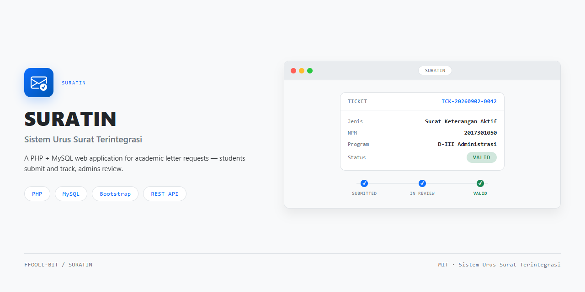

<div align="center">

<h1>SURATIN</h1>



**SURATIN** (Sistem Urus Surat Terintegrasi) - a web ticket system for managing student letter requests at academic institutions.

</div>

## Overview

SURATIN (Sistem Urus Surat Terintegrasi) is a web application for managing letter requests at an academic institution. Students submit letter requests as tickets (name, NPM, study program, letter type, attachments, contact) and track their status, while admins review submissions and mark them valid or rejected.

## Features

- Public ticket submission form with client-side validation
- Public ticket status tracking with activity history
- Admin dashboard with ticket list, filters, and statistics
- Ticket review workflow (valid / rejected) with activity logs
- Session-based admin authentication with role support
- REST API endpoints served from `controller/api/`

## Installation

Requires PHP and MySQL (XAMPP is the reference environment). Place the project under the web root (e.g. `htdocs/SURATIN`), then from the project root with MySQL running:

```bash
php run-schema.php       # create the database and schema
php run-sample-data.php  # insert sample data
```

## Usage

Open the project in a browser (e.g. `http://localhost/SURATIN/`). Submit a letter request on the public form, then track it with the ticket code. Admin features require a login (see the seeded admin accounts).

## Documentation

- [CHANGELOG.md](CHANGELOG.md) — release history
- [CONTRIBUTING.md](CONTRIBUTING.md) — how to contribute
- [CODE_OF_CONDUCT.md](CODE_OF_CONDUCT.md) — community standards
- [SECURITY.md](SECURITY.md) — security policy

## License

MIT. See [LICENSE](LICENSE).